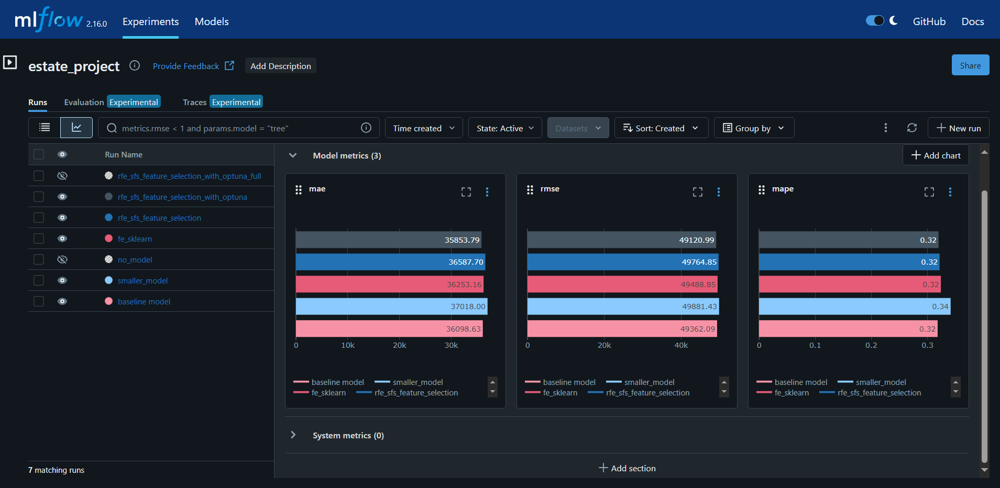
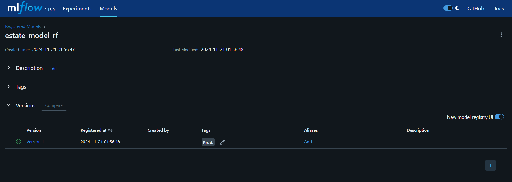

# Описание проекта
Проект посвящен решеню задачи предсказания зарплаты дата сайентиста
Ссылка на исходную выборку данных: https://www.kaggle.com/datasets/arnabchaki/data-science-salaries-2023?resource=download

# Установка

Для запуска проекта необходимо выполнить команды:
```
git clone https://github.com/HotlineOn/iis.git
cd iis
установка окружения
python venv [venv_name]
активация окружения
Linux: source [venv_name]/bin/activate
Windows: [venv_name]\Scripts\activate.bat
установка зависимостей: pip install -r requirements.txt
```
*\[venv_name\]* - имя директории для установки виртуального окружения. 

# Датесет

*Data Science Job Salaries Dataset* содержит 11 столбцов:
1. work_year: Год когда была выплачена зарплата.
2. experience_level: Уровень опыта работы в течение года.
3. employment_type: Тип найма для должности.
4. job_title: Должность в течение года.
5. salary: Сумма выплаченных зарплат за год.
6. salary_currency: Валюта, в которой выплачена зарплата, как ISO 4217 код валюты.
7. salaryinusd: Сумма выплаченных зарплат за год в долларах.
8. employee_residence: Основное место жительства работника в течение года, как ISO 3166 код страны.
9. remote_ratio: Количество рабочего времени удалённой работы
10. company_location: Страна, в которой находится главный офис работадателя или филиал, где работает реципиент
11. company_size: Медианное количество людей, работавших в компании в течение года
* experience_level, employment_type, job_title, salary_currency, employee_residence, company_location, company_size 
переведены в категориальный тип
* work_year переведён uint16
* salary и salary_in_usd переведены в uint32
* remote_ratio переведён в uint8 \
В результате по сравнению с типами по умолчанию датасет занимает
100 КБ вместо 300 КБ.


# Исследование данных

Находится в `./eda/eda.ipynb`. Основные результаты:
В ходе исследования были удалены страны в столбце company_location, которые представлены 1 раз
Обработанная выборка сохранена в файл `./data/dataet.pkl`


# Вывод исследования данных

* Работа в компании средних размеров примерно также перспективна, как и в большой
* Есть явное отставание в зарплате у людей на частичной удалёнке
* Есть слабая корреляция того, что со временем становятся больше зарплаты и меньше удалёнщиков
* Наиболее представленным регионом в выборке является США, более половины компаний и респондентов представляют этот регион
* Наиболее 'богатые' регионы: США, Калифорния, Мексика, Япония (только офис)


# Настройка и обучение модели

На настройки модели используется MLFlow
Для запуска локального сервера MLFlow выполнить находясь в директории `iis`:
```
активировать виртуальную среду [venv_name]
cd mlflow
Windows: start_mlflow_server.sh
Linux:
chmod +x ./start_mlflow_server.sh
./start_mlflow_server.sh
```
При исполнении команды на Windows откроется git bash.
После запуска MLFlow будет доступен по адресу: http://localhost:5000

Исследования находятся в директории `research`, они разделены на 2 файла `research1.ipynb` - модели на исходных данных и
`research2.ipynb` - модели на изменённых данных.


# Результаты исследования

Признаки, попавшие в обучающую выборку:
* experience_level
* employment_type
* job_title
* employee_residence
* remote_ratio из полинома 3 степени для \[work_year, remote_ratio\]
За отбор признаков отвечала библиотека mlxtend.

В качестве модели использовался RandomForestRegressor.
С помощью optuna были получены оптимальные параметры модели:
* n_estimators = 50
* max_depth = 8

При прогоне на тестовой выборке получены следующие результаты:
* mae = 35853.79120109564
* mape = 0.3197875543518546
* rmse = 49120.98542991532

Сравнение всех обученных моделей:


Зарегистрированные версии моделей:


run_id модели: 8494c03e6a5b41f6933f93f6246b1f42


# Создание сервисов

Для создания сервиса 
```
{
    "work_year": 2024,
    "experience_level": "SE",
    "employment_type": "FT",
    "job_title": "Data Scientist",
    "employee_residence": "US",
    "remote_ratio": 50,
    "company_location": "US",
    "company_size": "L"
}
```